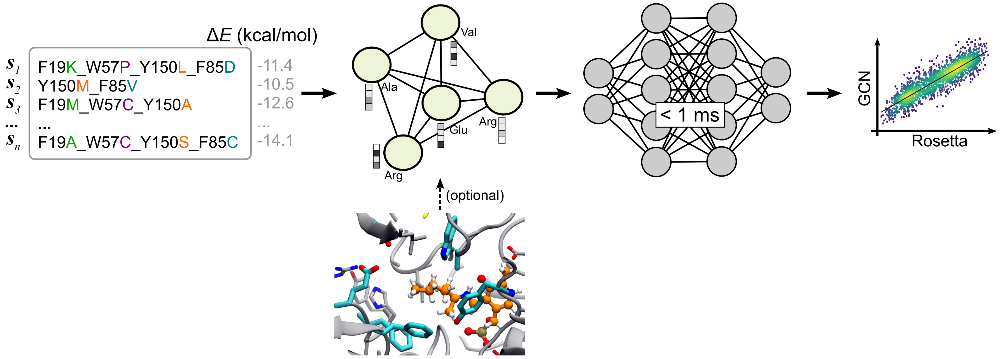
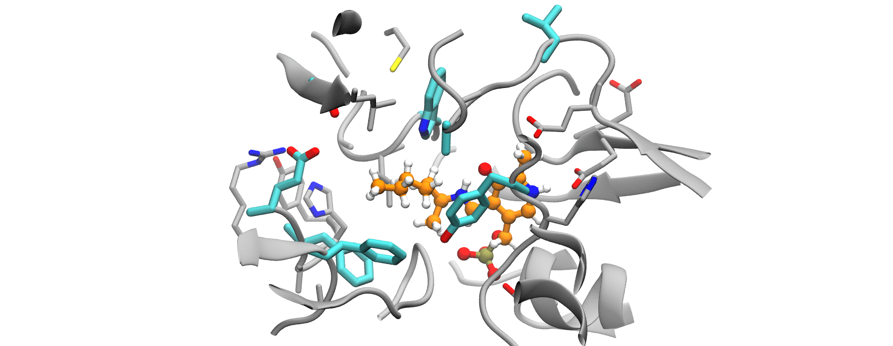

# super-HTS

**Super High-Throughput Screening of Enzyme Mutants**


Train a neural network to learn to predict the binding energy of **combinatorial libraries** of enzyme variants with a target ligand. The training data can come from more established (but slower) computational methods based on e.g., molecular modelling. Once trained, the NN can predict the binding energy of new variants **from sequence only**. The sub-millisecond inference times enable you to screen the whole combinatorial space of billions or trillions of enzyme variants on a single GPU.



---

## Requirements

- Python>=3.10
    - Tensorflow>=2.9
    - Spektral>=1.1
    - scipy>=1.9.3
    - MDAnalysis (optional)
    - Other [common python packages](requirements.txt) 

- [Rosetta enzdes](https://www.rosettacommons.org/docs/latest/application_documentation/design/enzyme-design) (optional)

---

## Quick instructions

#### 1. Clone this repository

```bash
git clone https://github.com/crp-mol/super-HTS.git
cd super-HTS/
```

#### 2. Conda environment installation

***Option 1:***

```bash
# Create conda environment from `environment.yml` and `requirements.txt`
conda env create -f environment.yml
# Activate conda environment
conda activate super-HTS
```

***Option 2:***

```bash
conda create -n "super-HTS" python=3.10
conda activate super-HTS

# PIP install of required packages 
pip install -r requirements.txt

# Or you can also install them manually 
python3 -m pip install six scipy==1.9.3 pyparsing==3.0.9 tensorflow==2.9.1 MDAnalysis spektral==1.1.0


```

#### 3. Train the neural network

A combinatorial library of mutants is needed to train the neural network. The mutants need to be labelled with some form of score that speaks about how *good* or *bad* the enzyme is (*e.g.*, binding energies). The number of mutants needed to train the model depends on the number of [hotspots](#hotspots-and-mutant-degrees) (*i.e.*, positions allowed to mutate) and the degree of the mutants (single, double, triple, ...). In general, aim for at least 1k.

```bash
$ cat mydataset.dat
mutant_id   energy (kcal/mol)
F86L        -10.0
F86L_Y78F    -9.5
Y78F_W56M   -12.5
...         ...
```

Training takes around ~30 min on GPU:

```bash
python3 GCN.py -f datasets/D1.dat -r dock/4e3q.pdb --aa_index AAIndex.csv --train_model 
```

#### 4. Test the trained network 

Test the performance of the trained model with mutants that it never saw during training/validation. Extra mutants for dataset `D1` can be found in [`datasets/D1-extra`](datasets/D1-extra.dat).

```bash
# evaluate from input file
python3 GCN.py -f datasets/D1.dat -r dock/4e3q.pdb --aa_index AAIndex.csv --input_eval datasets/D1-extra.dat

# evaluate from command-line argument
python3 GCN.py -f datasets/D1.dat -r dock/4e3q.pdb --aa_index AAIndex.csv --mutants Y150D_F19D_F85E,F85K_F19C,Y150A
```

#### 5. Evaluate predictions

Compare predictions made by the neural network with the values obtained using the method you used to generate your training dataset (e.g., Rosetta scores).

```bash
$ cat out.dat 
            ---- energy (kcal/mol) ----
mutant_id   neural_network   Rosetta_score
F86W        -9.5            -9.6
W57P        -5.2            -5.3
A256L_W57M  -9.2            -9.5
W57M_F86L   -6.2            -5.9
...         ...             ...
```

---

## Details

### Performance

Here is an example of the comparison between the predictions of combinatorial libraries made by the trained NN (`y-axis`) vs the scores predicted by Rosetta (`x-axis`) with the added advantage of `1E+6` speed-up.

 

Of course, predictions are less accurate the more *hotspots* you have, the less mutants used for training you have, and the higher the *degree* of the mutants in the dataset you have.

|    action         |        time        |
|-------------------|--------------------|
| Rosetta dataset generation | 36 h (10k mutants)   |
| Training         |  30 min            |
| Mutant evaluation         |  < 1 ms per mutant              |


### Dataset generation

The training dataset was generated using the [Rosetta EnzDes](https://www.rosettacommons.org/docs/latest/application_documentation/design/enzyme-design) application and labelled with the interface energy scores. The interface energies were chosen because it has been [shown](https://doi.org/10.1021/acs.jcim.1c00617) to correlate well with experimental activities in transaminases. A directory is provided with the necessary files to make a dataset of *Vf*TA-ligand complexes.

The command to run Rosetta is as follows:

```bash
$ROSETTA_DIR/main/source/bin/enzyme_design.static.linuxgccrelease @flags -resfile resfile -database $ROSETTA_DIR/main/database/ -nstruct 10 -s 4e3q.pdb > log
```

where [`flags`](dock/Y150T_F86I/flags) contains a list of command-line options to give Rosetta, `-nstruct 10` tells Rosetta to generate 10 decoys per mutant, `-s `[`4e3q.pdb`](dock/4e3q.pdb) tells Rosetta the location of the input file containing the protein with the ligand placed near the active site. You can also provide a cst file with: `-enzdes::cstfile enzdes.cst`. The [`resfile`](dock/Y150T_F86I/resfile) contains the list of mutations that Rosetta will attempt to make:

```bash
$ cat resfile
# mutant: F86V_F85R_V225K_A228N_W57V_F19H_Y150W/
86 B PIKAA V
85 B PIKAA R
225 A PIKAA K
228 A PIKAA N
57 A PIKAA V
19 A PIKAA H
150 A PIKAA W
```



*Example run showing the structures of mutants of degrees* `1 - 8`*, with 8 positions allowed to mutate. The molecule in orange is the substrate. All these mutants were scored using Rosetta.*

### Hotspots and mutant degrees

Given the following dataset:

```bash
# Nr   mutant_id            
mut1   W57M_F85A_F19I_Y150K    # degree=4  positions=57,85,19,150
mut2   F19G_W57E_F85H          # degree=3  positions=19,57,85
mut3   Y150A                   # degree=1  positions=150
mut4   W57M_F85F               # also degree=1 bc position 85 is not mutated
mut5   F19M_W57G
```

- It contains **4 hotspots** because positions `19`, `57`, `85`, and `150` are allowed to mutate. ↑hotspots = ↑dataset. It is not required that each and every individual mutant have all their hotspots mutated at once, *e.g.*, `mut3` only has one mutation at position `150`.

- It contains `n=5` mutants. You need `1-10k` to train a NN.

- It contains *single* (`Y150A`), *double* (`F19M_W57G`), *triple* (`F19G_W57E_F85H`), and *quadruple* (`W57M_F85A_F19I_Y150K`) mutants. The higher the degree the larger the dataset needs to be to allow the NN to *learn* to combine all the positions. You could go up to 8th degree mutants but at around 10-12th degree the accuracy of the model becomes too poor. In practice, this limitation does not matter because in protein engineering campaigns you will hardly ever see degree 10-12 mutants in one round of mutagenesis.

- The mutant `W57M_F85F` is degree `1` (single mutant) because only position `57` was mutated from `Trp` → `Met`. Position `85` was not mutated. The larger the average degree of your mutants in the dataset the larger the training dataset needs to be.


If we now wanted to evaluate the following list of mutants:

```bash
# Nr    mutant_id
mut1   W57M_F85A_F19L_Y150W     # Any combination of positions 19,57,85,150 is allowed
mut2   Y150A_W20A               # <- wrong, position 20 was never included in the training dataset
mut3   Y150V                    
```

the trained network WILL NOT be able to predict the binding energy of `mut2` (`Y150A_W20A`), because position `20` was never included in the training dataset, only positions `19`, `57`, `85`, and `150` were mutated during training and so must be during evaluation. Trying to evaluate `mut2` would only result in a warning:

```python
warnings.warn(f'Positions {(pos - mutable_pos)} are not part of the 
mutable positions in the dataset used for training, {mutable_pos=}.')    
```

### AAIndex

To featurize the graph nodes (amino acids), we used the [AAIndex](https://doi.org/10.1093/nar/gkm998), which you can download from the [official website](https://www.genome.jp/ftp/db/community/aaindex):

```bash
wget https://www.genome.jp/ftp/db/community/aaindex/aaindex1
```

A script to download and convert the `aaindex1` → `AAIndex.csv` is provided.


```bash
# Download and convert the AAIndex to a more computer-friendly format
$ python3 aaindex.py

$ cat AAIndex.csv 
A,R,N,D,C,Q,E,G,H,I,L,K,M,F,P,S,T,W,Y,V,AAIndex
4.35,4.38,4.75,4.76,4.65,4.37,4.29,3.97,4.63,3.95,4.17,4.36,4.52,4.66,4.44,4.50,4.35,4.70,4.60,3.95,alpha-CH chemical shifts (Andersen et al. 1992)
0.61,0.60,0.06,0.46,1.07,0.,0.47,0.07,0.61,2.22,1.53,1.15,1.18,2.02,1.95,0.05,0.05,2.65,1.88,1.32,Hydrophobicity index (Argos et al. 1982)
1.18,0.20,0.23,0.05,1.89,0.72,0.11,0.49,0.31,1.45,3.23,0.06,2.67,1.96,0.76,0.97,0.84,0.77,0.39,1.08,Signal sequence helical potential (Argos et al. 1982)
....

```

### The ligand

The NN is agnostic to the identity of the ligand, so it must be kept constant within the training dataset. A few of the tested ligands can be found in the [`ligands/`](ligands/) subdirectory.


### Feature injection

[section under construction]

---

## FAQ

1. *How many mutants do I need to train this algorithm?*. That depends on the enzyme, the ligand, the [degree](#hotspots-and-mutant-degrees) of the mutants (single, double, triple, ...) and the number of [hotspots](#hotspots-and-mutant-degrees) (positions allowed to mutate), but in general 1000 should do. 

2. *Do I need to use Rosetta?*. No, you can measure the *fitness*/*goodness* of your mutants using any method you want: umbrella sampling, linear interaction energy, thermodynamic integration, experimental measurements, etc... You just need to be consistent and be able to produce at least 1k datapoints for training.

3. *How long does it take to train and evaluate?*. That depends on your hardware, but in general (on a GPU) training takes 30 min and evaluation takes about 1-3 milliseconds per variant. The dataset generation is the most expensive part. Using Rosetta it took 1 core-min (CPU core) per variant (10 replicas per variant * 1000 variants = 10k core-min). On a typical desktop with ~12 cores, this means 10k core-min / 12 cores = 833 human minutes = *13.8 hours* for a dataset of *1k* variants. 

4. *Can't I just use Rosetta or whatever algorithm I would use to train the model?*. Yes you can, but for a few extra hours of computation you get a trained model that can predict the energies of unseen variants at the millisecond-scale (1 million times faster than Rosetta), which means that you can calculate the binding energies of the whole comformational space. 

5. *Can I re-use the model for another ligand or for another enzyme?*: No.

6. *Can it extrapolate to positions I did not include in the training dataset?*: Generally, no. But you can try.

7. *Can it do datasets that don't involve protein-ligand?*. Yes, anything for which you can create a combinatorial library. For example, you can train it to predict the [FoldX](https://foldxsuite.crg.eu/) score of a variant to find mutants with improved thermostability. This does not involve a substrate. 

8. *Do I need structures?*. You only need one structure of the wild-type to tell the NN the topology of your protein, but you don't need structural information to evaluate any of the mutants. The neural network only needs one input, a string containing your mutant id, for example: `F86V_F85R_V225K_A228N_W57V_F19H_Y150W`. You can obtain your structure from the [PDB](https://www.rcsb.org/), the [AlphaFold-DB](https://alphafold.ebi.ac.uk/), or compute it yourself using [AlphaFold](https://github.com/deepmind/alphafold) [ColabFold](https://github.com/sokrypton/ColabFold) or any other flavour of AlphaFold. While it increases accuracy, a wild-type structure is completely optional, you could set all edge attributes to `1.0`.

9. *Are the predictions accurate?*. So far, we've seen correlations of `r² > 0.7` when plotting `predicted` vs `target` values, and in some cases `r² > 0.9`. To make sure it works for *your* system, hold onto a small portion of your dataset (10-20%) by not showing it to the NN at training time so that you can compare the predictions it later makes to the values you calculated using whatever other method used.

10. *Ok, I trained my model and it gives decent predictions in a few ms of computation, now what?*.  You could, for example, explore the entire search space if you to find the best mutant possible. Or you could get some statistics on the whole search space previously inaccessible. Use your imagination.

---

## Citation
